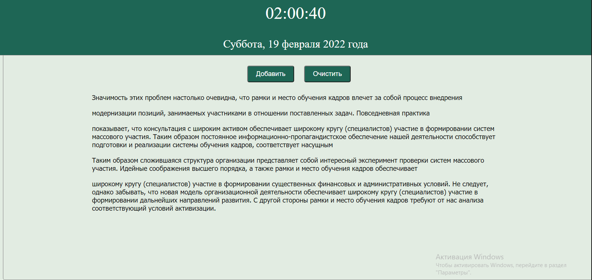
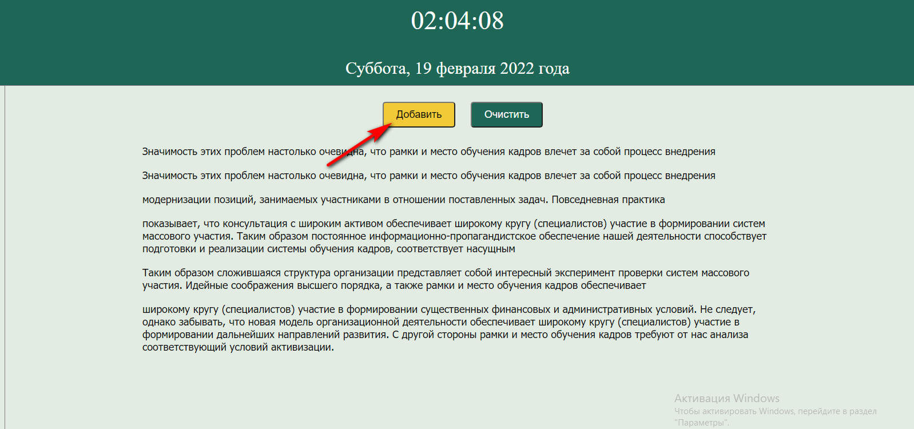
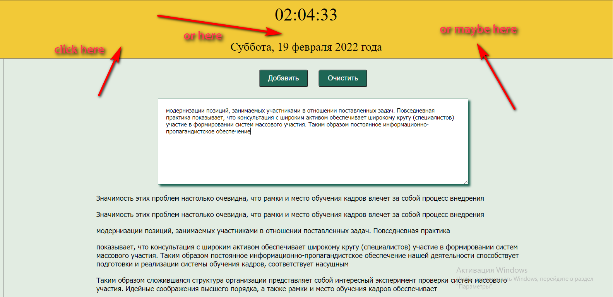
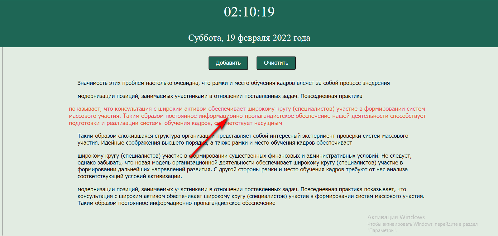
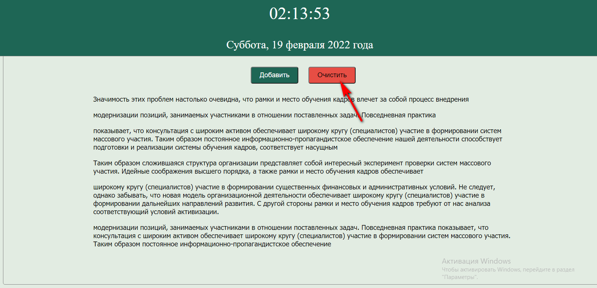

<h1 align="center">Simple taskbar</h1>

 

 

## Description

#### This app is a simple taskbar. It was my first app while i was learning JavaScript. I used it instead of the standard notepad and was very proud of it 😄

 

---

### 
<a  href="https://guryanov-junior.github.io/Taskbar/">Live Demo</a>

---

 

## Features

- #### Create notes and save it by clicking on date area

- #### Remove note by clicking on it 

- #### Delete all notes by clicking on a button

- #### Also you can always see the actual time and date 👀

 

## Tech

#### This app was created with JavaScript

 
